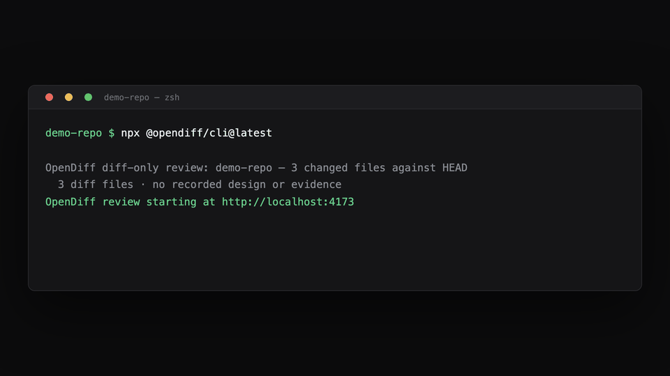

# OpenDiff

[](LICENSE)
[](package.json)
[](https://www.npmjs.com/package/@opendiff/cli)

**Review code you did not write.**

A raw diff tells you what changed, but not whether the design is sound, which invariants matter, which claims have evidence, or where uncertainty remains. OpenDiff turns a change into something you can actually read — and, when a coding agent recorded the reasoning behind it, into a review of that reasoning against the real Git diff.



OpenDiff is **local-first** and **deterministic**. It does not upload source code, call an additional model, create a pull request, or modify source files or Git state. Local review artifacts remain ignored under `.opendiff/`.

## Try it now

In any Git repository, with no account, no API key, and nothing installed:

```bash
npx --yes @opendiff/cli@latest
```

That opens the current working-tree change in your browser. Nothing else is required.

## Two levels

**Level 0 — any repository.** `opendiff` reads the working tree and shows the change: staged, unstaged, and untracked, with syntax highlighting, split or unified layout, adjustable context, and per-file review state.

**Level 1 — guided.** Install the skill, and the coding agent that makes a change also records the design and evidence behind it. OpenDiff then validates those claims against the real diff and adds two views:

- **Design** — the problem, desired outcome, decisions, alternatives, invariants, non-goals, and deviations.
- **Evidence** — acceptance criteria tied to tests, checks, risks, and precise implementation references.

OpenDiff clearly distinguishes verified criteria from claims without evidence, executed checks from skipped ones, current reviews from ones made stale by later changes, and resolved code references from missing ones.

## Share a review

```bash
opendiff share
```

This writes a single self-contained HTML file — every script, style, and syntax grammar inlined, no network access required. Open it from disk, attach it to a pull request, or send it to someone who has neither the repository nor OpenDiff.

To publish it as a GitHub Gist instead, add `--gist`. Because that uploads the diff, including your source code, to GitHub, OpenDiff asks for confirmation first and never uploads without an explicit yes.

## Requirements

- **Node.js 20.19 or newer**
- **Git**
- **Codex and/or Claude Code**

No account, remote service, or API key is required.

## Install the guided level

Level 0 needs no installation. To unlock Design and Evidence, install the OpenDiff skill once:

```bash
npx --yes @opendiff/cli@latest install
```

The installer detects Codex and Claude Code automatically. To select one explicitly:

```bash
npx --yes @opendiff/cli@latest install --agent codex
npx --yes @opendiff/cli@latest install --agent claude
npx --yes @opendiff/cli@latest install --agent all
```

Restart an agent that was already open after installation.

## Create your first review

Open a Git repository in your coding agent and ask it to implement a change:

```text
@opendiff implementa questa modifica e mostrami la review
```

You can also review changes already present in the working tree:

```text
@opendiff spiegami queste modifiche con una review, senza cambiare il codice
```

The agent captures the Git baseline, records the design, performs the work, runs relevant checks, validates the final review, and opens OpenDiff in your browser.

You do not need to run any OpenDiff command during the normal workflow.

## Read a review

Start with **Design** and decide whether the proposed mental model is correct. Then use **Evidence** to inspect verified and unverified criteria, checks, risks, and implementation references. Open **Diff** only when you need complete line-level context.

Clicking a criterion in Design opens its supporting evidence. Clicking an implementation reference jumps to the corresponding changed lines.

OpenDiff clearly distinguishes:

- verified criteria from claims without evidence;
- executed checks from checks that were skipped;
- current reviews from reviews made stale by later working-tree changes;
- resolved code references from missing or outdated references.

## Useful commands

The installed skill normally runs OpenDiff for you. These commands are available when you need them:

| Command | When to use it |
| --- | --- |
| `opendiff` | Open the current working-tree change. |
| `opendiff share` | Write a single self-contained HTML file of the review. |
| `opendiff doctor` | Check Node.js, Git, the bundled renderer, and agent installation. |
| `opendiff review` | Validate and open the review in the current repository. |
| `opendiff review --no-open` | Start the local review server without opening a browser. |
| `opendiff export --output PATH` | Create a portable static review folder. |
| `opendiff install --force` | Repair or refresh the installed agent skill. |
| `opendiff uninstall` | Remove the installed skill. |

When invoking commands without a global installation, use the npm package:

```bash
npx --yes @opendiff/cli@latest doctor
npx --yes @opendiff/cli@latest review
```

## Troubleshooting

### The `@opendiff` skill is not recognized

Restart Codex or Claude Code after installation. If the problem continues:

```bash
npx --yes @opendiff/cli@latest doctor
npx --yes @opendiff/cli@latest install --force
```

### The browser does not open

Run the review without automatic browser launch:

```bash
npx --yes @opendiff/cli@latest review --no-open
```

Open the local URL printed by the command. Keep that terminal process running while reading the review.

### The review is stale

The working tree changed after the review was generated. Ask the implementing agent to refresh the review against the final diff, then reopen it.

### A reference cannot be resolved

The referenced file or line range no longer matches the current working tree. The rest of the review remains available, but the agent should regenerate its references before you rely on that explanation.

## Privacy and sharing

The OpenDiff server binds to `127.0.0.1`. Source code and review data stay on your machine, and OpenDiff includes no telemetry or remote source-code transport.

Review narratives and exported folders can still contain sensitive repository context. Inspect an exported review before sharing it with another person.

## Support

For reproducible bugs or usage problems, see [SUPPORT.md](SUPPORT.md). Include your OpenDiff version, operating system, Node.js version, exact command, and sanitized output. Do not attach proprietary source code or a sensitive `.opendiff/review.json` without permission.

Report security vulnerabilities privately using [SECURITY.md](SECURITY.md).

OpenDiff is pre-1.0, so CLI and interface behavior may evolve between minor releases. It is released under the MIT License.

OpenDiff is independent and is not affiliated with or endorsed by Linear.
