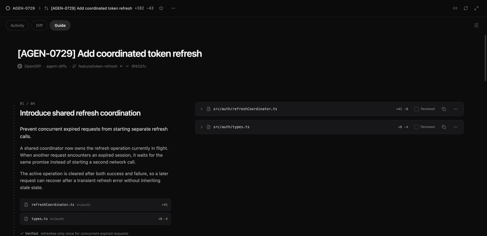

# OpenDiffs

[](https://github.com/francescogabrieli/OpenDiffs/actions/workflows/ci.yml)
[](LICENSE)
[](package.json)

OpenDiffs turns a coding agent's working-tree changes into a local, guided code review. The same agent that implements the work explains it; OpenDiffs validates those explanations against the real Git diff and presents the review by intent instead of filename.



OpenDiffs is local-first and deterministic. It does not upload source code, call an additional model, create a pull request, or modify the repository being reviewed.

## Install the agent skill

Install once with npm. No repository clone or manual file copy is required.

```bash
npx --yes opendiffs@latest install
```

The installer detects Codex and Claude Code and writes the same bundled skill to the appropriate local skill directories:

```text
~/.codex/skills/opendiffs/SKILL.md
~/.claude/skills/opendiffs/SKILL.md
```

When both agents are present, both are configured. To choose explicitly:

```bash
npx --yes opendiffs@latest install --agent codex
npx --yes opendiffs@latest install --agent claude
npx --yes opendiffs@latest install --agent all
```

Restart an agent that was already open, then invoke the skill from chat:

```text
@opendiffs implementa questa modifica e mostrami la guided review
```

The coding agent implements the task, records the final narrative and references, validates them against the actual Git diff, starts the bundled local renderer, and opens the complete OpenDiffs interface.

Useful maintenance commands:

```bash
npx --yes opendiffs@latest doctor
npx --yes opendiffs@latest install --force
npx --yes opendiffs@latest uninstall
```

## What the skill does

```text
user invokes @opendiffs
   │
   ▼
coding agent captures the Git baseline
   │
   ├── implements and verifies the requested change
   ├── reads the complete final diff
   └── writes .opendiffs/review.json
   │
   ▼
npx opendiffs review
   │
   ├── validates the authored references
   ├── derives the real staged, unstaged, and untracked Git diff
   ├── starts the bundled local renderer
   └── opens the guided review in the browser
```

The user does not need to run `init`, `validate`, `render`, or `open`. Those lower-level commands remain available for maintainers and debugging, while the installed skill owns the normal end-to-end workflow.

## Why OpenDiffs?

Agent-generated changes are often easier to produce than to understand. A raw diff tells you what changed, but not the intended reading order, why several files belong together, which checks ran, or where uncertainty remains.

OpenDiffs adds that missing presentation layer:

- a guided path organized by implementation intent;
- explanations anchored to exact files and lines;
- the real staged, unstaged, and untracked changes;
- executed and skipped checks, risks, assumptions, and completion state;
- stale-review detection when the working tree changes afterward;
- a polished local UI bundled with the npm package.

## Runtime commands

The skill normally invokes these automatically. They are documented for development and troubleshooting.

| Command | Purpose |
| --- | --- |
| `opendiffs install` | Install the `@opendiffs` skill for Codex and/or Claude Code. |
| `opendiffs uninstall` | Remove the installed skill. |
| `opendiffs doctor` | Check Node, Git, the bundled renderer, and agent installation paths. |
| `opendiffs validate` | Validate the review schema, Git base, IDs, files, and line references. |
| `opendiffs render` | Materialize the review against the current working tree. |
| `opendiffs open` | Start the bundled local renderer. |
| `opendiffs review` | Validate, render, and open in one command. |
| `opendiffs export --output PATH` | Create a portable static review folder. |

Common runtime options are `--base REF`, `--context N`, `--port PORT`, `--no-open`, and `--force`.


## The npm package contains the full app

The npm package is a distribution of this repository, not a reduced installer. It includes:

```text
cli/       installer and local runtime
skills/    the agent-authored review workflow
dist/      the built HTML, JavaScript, CSS, and UI assets
schemas/   the machine-readable review schema
docs/      format and architecture documentation
```

The `prepack` script runs tests and creates the production renderer before npm assembles the package. The interface opened by `npx opendiffs review` is therefore built from the same frontend source as the repository.

## Review format

The agent-owned `.opendiffs/review.json` contains metadata, ordered sections, explanations, impacts, precise code references, verification results, risks, assumptions, and completion state. OpenDiffs separately derives the diff contents and statistics from Git.

```json
{
  "id": "ref-refresh-coordinator",
  "file": "src/auth/refreshCoordinator.ts",
  "symbol": "createRefreshCoordinator",
  "kind": "primary",
  "newLines": { "start": 12, "end": 58 },
  "oldLines": null,
  "description": "Owns the shared refresh operation."
}
```

See the [review format guide](docs/REVIEW_FORMAT.md), the machine-readable [JSON Schema](schemas/review.schema.json), and the bundled [OpenDiffs skill](skills/opendiffs/SKILL.md).

## Development

Requirements:

- Node.js 20.19 or newer;
- npm;
- Git;
- Chrome or Chromium for end-to-end tests.

```bash
git clone https://github.com/francescogabrieli/OpenDiffs.git
cd OpenDiffs
npm ci
npm run dev
npm test
npm run build
npm run test:e2e
```

Test the exact publishable package before a release:

```bash
npm run package:check
npm pack
npx --yes ./opendiffs-0.1.0.tgz install --agent codex
```

Use `npm run check` for the fast CI-equivalent checks. Browser fixtures are documented in [examples/README.md](examples/README.md).

## First npm release

The first release is published manually by the package owner:

```bash
npm login
npm whoami
npm ci
npm run check
npm run package:check
npm publish
```

After publishing, verify the registry version and the real user flow:

```bash
npm view opendiffs version
npx --yes opendiffs@0.1.0 install
```

Future releases can use npm Trusted Publishing from GitHub Actions without storing a long-lived npm token.

## Project status

OpenDiffs is pre-1.0. The review schema is versioned independently and currently at `1.0`; CLI and UI behavior may evolve between minor releases. Compatibility-impacting changes must be documented in [CHANGELOG.md](CHANGELOG.md).

## Security and privacy

The server binds to `127.0.0.1`, generated review artifacts are Git-ignored, and no telemetry or remote source-code transport is included. Review narratives can still contain sensitive repository context, so inspect exported folders before sharing them.

Report vulnerabilities privately using [SECURITY.md](SECURITY.md). For usage questions, see [SUPPORT.md](SUPPORT.md).

## Contributing

Bug reports, focused feature proposals, documentation improvements, fixtures, and code changes are welcome. Please read [CONTRIBUTING.md](CONTRIBUTING.md) and the [Code of Conduct](CODE_OF_CONDUCT.md).

OpenDiffs is released under the MIT License.

OpenDiffs is an independent project and is not affiliated with or endorsed by Linear. Linear is used only as a product-experience reference; no proprietary source code or assets are included.
