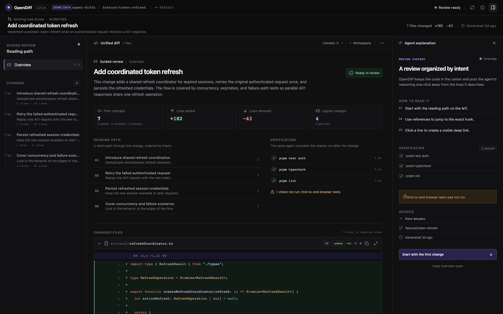

# OpenDiff

[](https://github.com/francescogabrieli/OpenDiff/actions/workflows/ci.yml)
[](LICENSE)
[](package.json)

OpenDiff turns a coding agent's working-tree changes into a local, guided code review. The agent explains the work it just performed; OpenDiff validates those explanations against the real Git diff and renders an ordered review by intent instead of filename.



OpenDiff is local-first and deterministic. It does not upload source code, call an AI model, create a pull request, or modify the repository being reviewed.

## Why OpenDiff?

Agent-generated changes are often easier to produce than to understand. A raw diff tells you what changed, but not the intended reading order, why several files belong together, which checks ran, or where uncertainty remains.

OpenDiff adds that missing presentation layer:

- a guided path organized by implementation intent;
- explanations anchored to exact files and lines;
- the real staged, unstaged, and untracked Git changes;
- executed and skipped checks, risks, assumptions, and completion state;
- stale-review detection when the working tree changes afterward.

## Quick start

OpenDiff is currently source-distributed while the first public package release is prepared.

```bash
git clone https://github.com/francescogabrieli/OpenDiff.git
cd OpenDiff
npm ci
npm run build
npm link
agent-diffs skill install
```

Then, from the repository you want to review:

```bash
cd /path/to/your/repository
agent-diffs init
```

Ask your coding agent to use the OpenDiff skill while implementing a task. When the agent finishes, validate and open the review:

```bash
agent-diffs review
```

OpenDiff validates the review, starts the bundled local renderer, and opens the browser automatically. Add `--no-open` in headless environments; the command still prints the local URL.

To explore the interface without changing another repository:

```bash
npm run dev
```

Visit `http://localhost:4173/?demo=1`.

## How it works

```text
user task
   │
   ▼
coding agent ── implements and verifies the change
   │
   ├── writes .agent-diffs/review.json (narrative + references)
   │
   ▼
OpenDiff CLI ── reads the real Git diff, validates references, computes metadata
   │
   ▼
local renderer ── presents the guided review at 127.0.0.1
```

The same agent that implemented the change authors the narrative. The renderer never invents an explanation and `review.json` never contains the full source diff.

## CLI

| Command | Purpose |
| --- | --- |
| `agent-diffs init` | Create local configuration and ignore generated review artifacts. |
| `agent-diffs skill install` | Install the bundled skill for supported coding agents. |
| `agent-diffs validate` | Validate schema, Git base, IDs, files, and line references. |
| `agent-diffs render` | Materialize the review against the current working tree. |
| `agent-diffs open` | Start the local renderer. |
| `agent-diffs review` | Validate, render, and open in one command. |
| `agent-diffs export --output PATH` | Create a portable static review folder. |

Common options are `--base REF`, `--context N`, `--port PORT`, `--no-open`, and `--force`. Run `agent-diffs --help` for the complete command summary.

## Review format

The agent-owned `.agent-diffs/review.json` contains metadata, ordered sections, explanations, impacts, precise code references, verification results, risks, assumptions, and completion state. OpenDiff separately derives diff contents and statistics from Git.

```json
{
  "id": "ref-refresh-coordinator",
  "file": "src/auth/refreshCoordinator.ts",
  "symbol": "createRefreshCoordinator",
  "kind": "primary",
  "newLines": { "start": 12, "end": 58 },
  "oldLines": null,
  "description": "Owns the shared refresh operation."
}
```

See the [review format guide](docs/REVIEW_FORMAT.md), the machine-readable [JSON Schema](schemas/review.schema.json), and the bundled [agent skill](skills/agent-diffs/SKILL.md).

## Development

Requirements:

- Node.js 20.19 or newer; Node.js 22 is the contributor default;
- npm, bundled with Node.js;
- Git;
- Chrome or Chromium for end-to-end tests.

```bash
npm ci
npm run dev
npm test
npm run build
npm run test:e2e
```

Use `npm run check` for the fast CI-equivalent checks and `npm run package:check` to inspect the publishable tarball. Browser fixtures are documented in [examples/README.md](examples/README.md).

The repository is intentionally small. Start with the [architecture guide](docs/ARCHITECTURE.md), then read [CONTRIBUTING.md](CONTRIBUTING.md) before opening a pull request.

## Project status

OpenDiff is pre-1.0. The review schema is versioned independently and currently at `1.0`; CLI and UI behavior may still evolve between minor releases. Compatibility-impacting changes must be documented in [CHANGELOG.md](CHANGELOG.md).

## Security and privacy

The server binds to `127.0.0.1`, generated review artifacts are Git-ignored, and no telemetry or remote source-code transport is included. Review narratives can still contain sensitive repository context, so inspect exported folders before sharing them.

Report vulnerabilities privately using [SECURITY.md](SECURITY.md). For usage questions, see [SUPPORT.md](SUPPORT.md).

## Contributing

Bug reports, focused feature proposals, documentation improvements, fixtures, and code changes are welcome. Please read [CONTRIBUTING.md](CONTRIBUTING.md) and the [Code of Conduct](CODE_OF_CONDUCT.md).

OpenDiff is released under the [MIT License](LICENSE).

OpenDiff is an independent project and is not affiliated with or endorsed by Linear. Linear is used only as a product-experience reference; no proprietary source code or assets are included.
